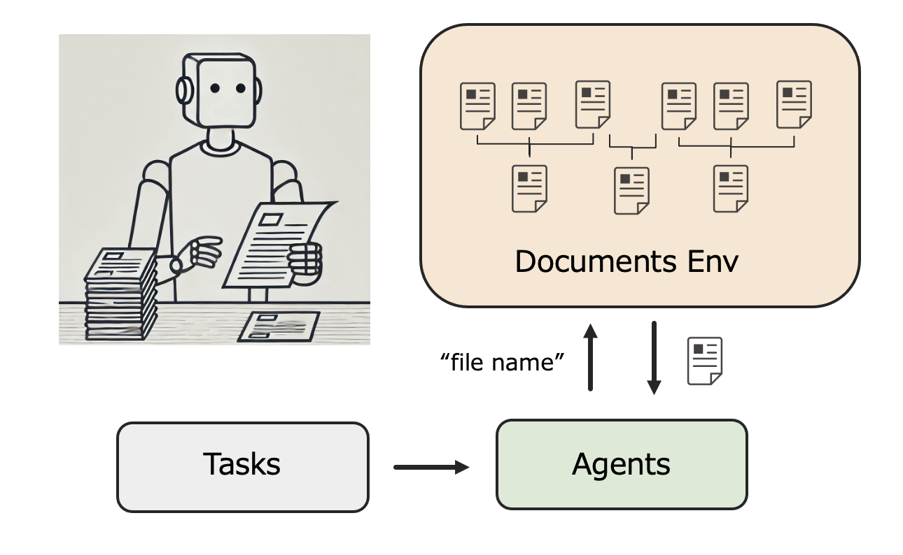
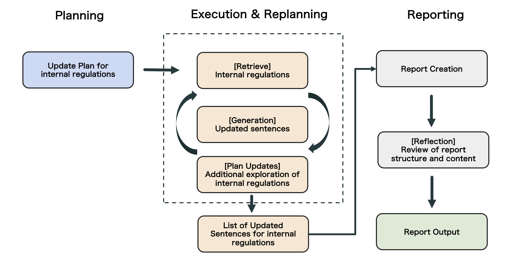
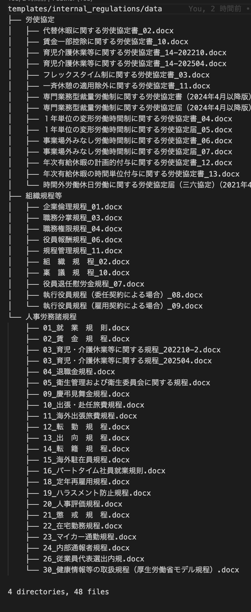
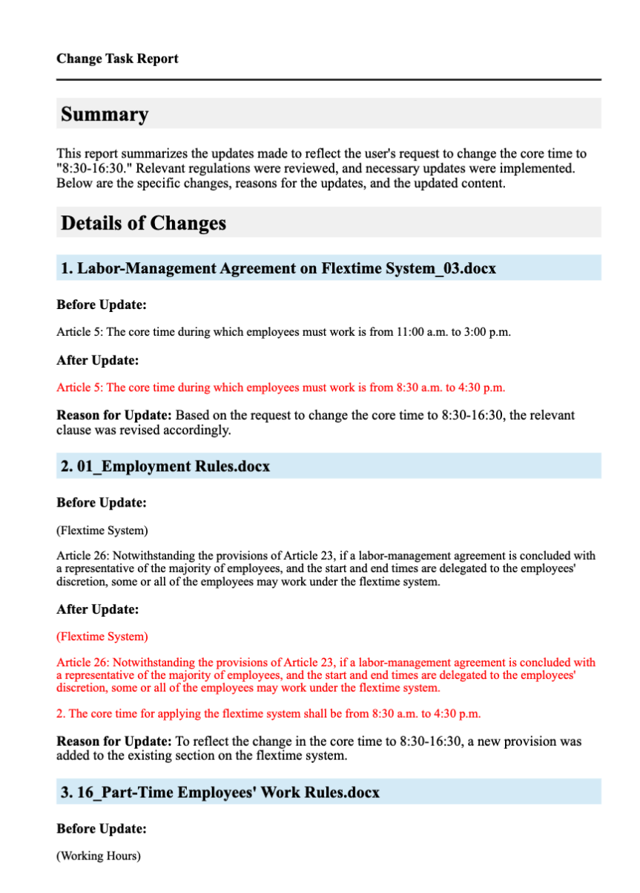

# internal-regulation-agent

## Introduction
I have developed an AI agent that explores internal company documents. Unlike Retrieval-Augmented Generation (RAG), this agent selects which files to check by reviewing the list of filenames in the knowledge bank. After reading the selected files, it determines whether additional files need to be reviewed. Through this step-by-step process, the agent systematically explores internal documents while staying focused on its objective.

<figure style="text-align: center;">
    
</figure>

## Applications
This AI agent can be used for various tasks, including:

- Updating internal regulations
- Revising product manuals
- Updating internal operation manuals
- Ensuring sales proposals meet internal standards
- Creating product specifications based on new feature development

The current prompt is specifically tuned for updating internal regulations.

## Agent Architecture
<figure style="text-align: center;">
    
</figure>

The agent operates through the following steps:

1. **Planning**: Generates a list of internal regulation filenames and selects multiple target files for updates.
2. **Execution**: Retrieves the full text of one of the selected target files.
3. **Processing**: Identifies sections requiring updates and generates revised content.
4. **Replanning**: Determines if additional related files should be retrieved based on the extracted text.
5. **Iteration**: Repeats the process until the list of target files is empty.
6. **Reporting**: Compiles and outputs a summary report of the identified necessary revisions.
7. **Reflection**: Refines the report to improve its formatting and clarity.

**⚠️ Safty**: To prevent looping, completed and upcoming tasks are included in the prompt to avoid redundant file exploration. A system-enforced 15-minute time limit also constrains execution.

## Installation

```bash
conda create -n ai_scientist python=3.11
conda activate ai_scientist
# Install pdflatex
sudo apt-get install texlive-full tree

# Install PyPI requirements
pip install -r requirements.txt
```

## Setting Up the Templates
Create a project under the template directory.

Example: `internal_regulations`

Inside the project directory, create a `data` folder and store the relevant documents. The directory structure can be hierarchical.

Currently, the agent supports `.docx` files. If you need support for additional formats, such as PDFs, modify the data reading section in `execute_plan.py` accordingly.

I used these japanese docs [here](https://www.ohno-jimusho.co.jp/m_bunrui/m_cate2/).

**Note**:
A file named `internal_regulation_summary.txt` will be generated. This file lists the document filenames, preserving their hierarchical structure, and is used by the agent to determine which files to read. The implementation internally utilizes the `tree` command.

<figure style="text-align: center;">
    
</figure>

## Running the Internal Regulation Agent

```bash
python launch_agent.py --model gpt-4o-2024-11-20 --experiment internal_regulations --skip_summary_file_creation False --query "Change core working hours to 8:30-16:30. Provide the regulations that need to be updated along with the revised text."
```

The process may take several minutes to generate results. The output report will be saved in the `results` folder.

Currently, reports are generated in both Japanese and English.

## Result Example
<figure style="text-align: center;">
    
</figure>

